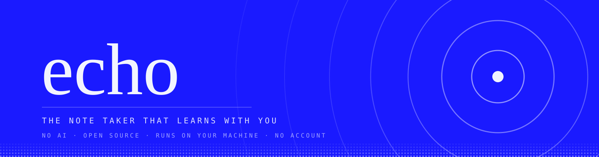
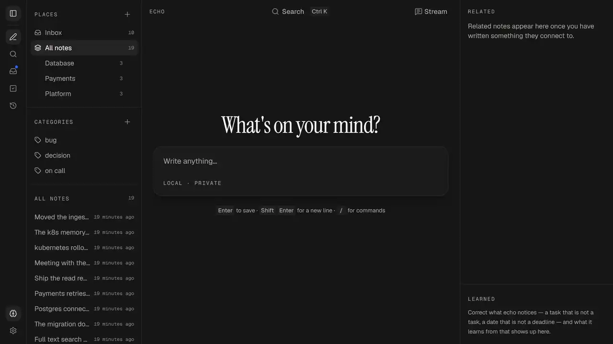
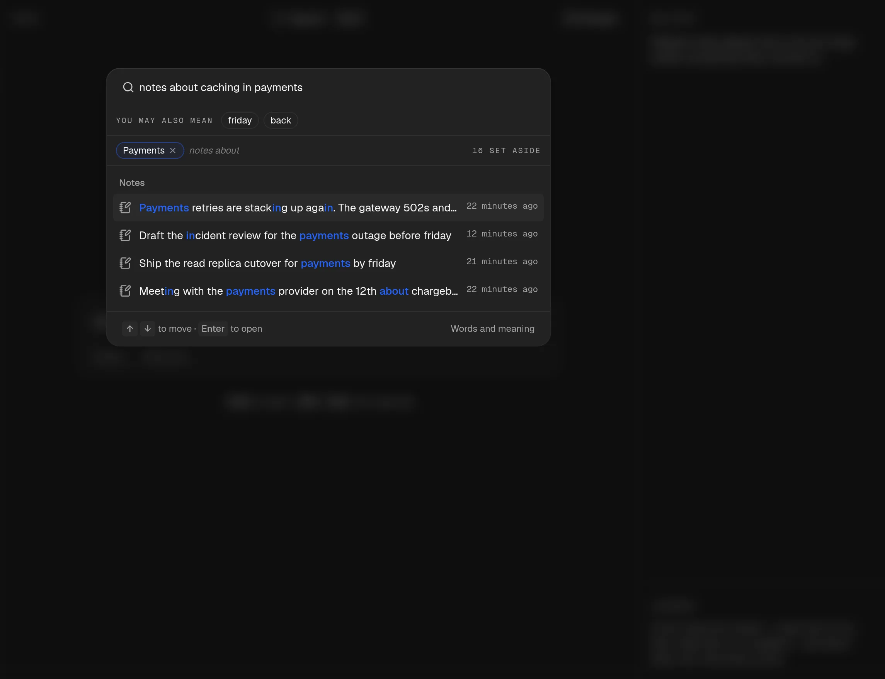
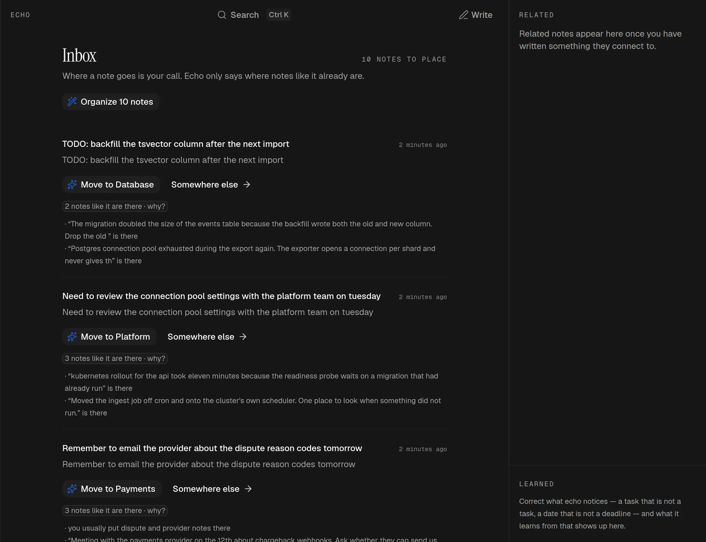
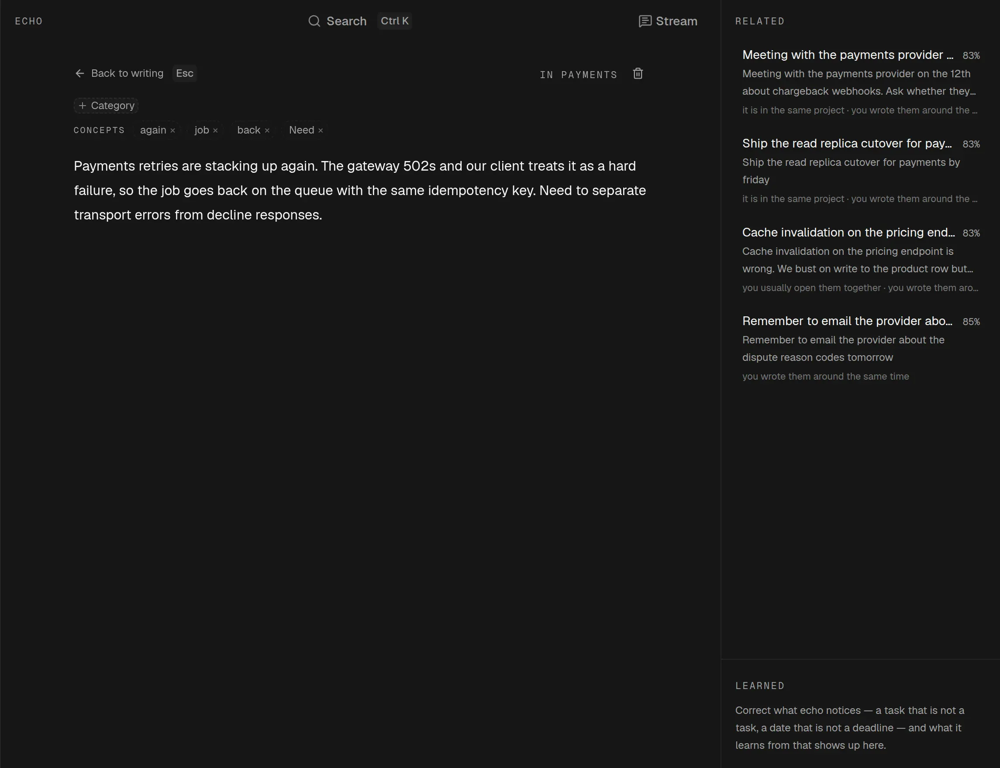
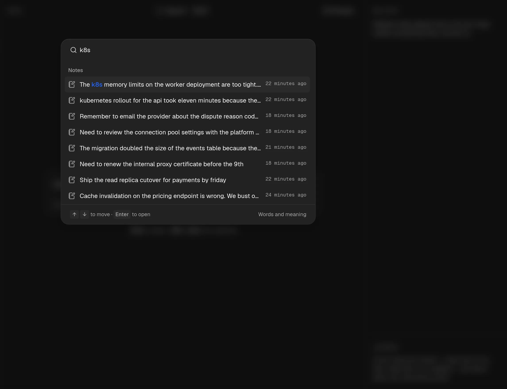
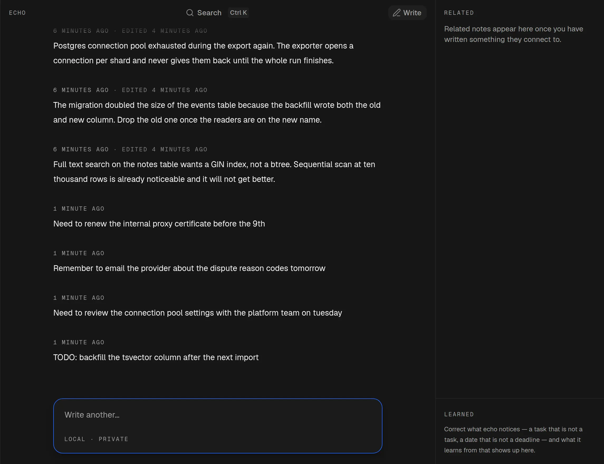
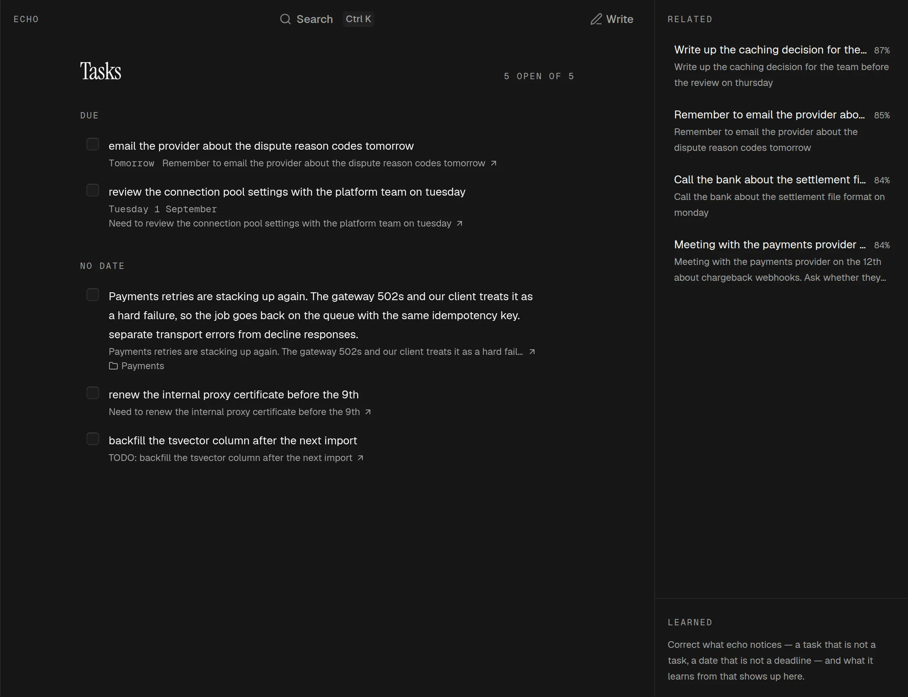
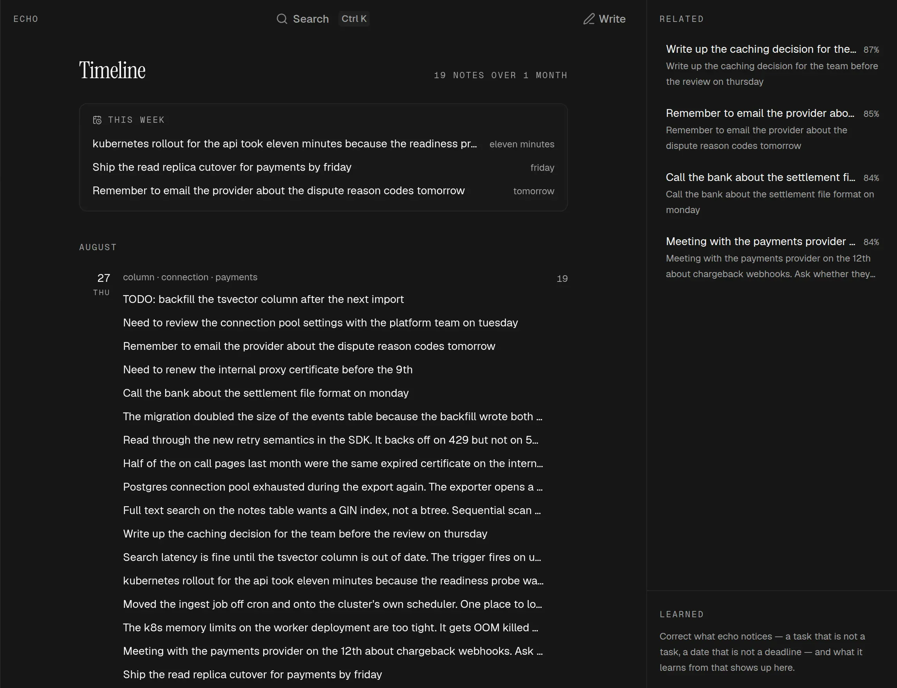
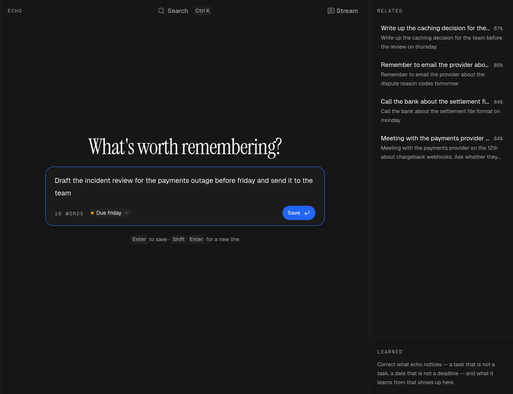

<p align="center">
  
</p>

<p align="center">
  <b>English</b> · <a href="README.pt-BR.md">Português (Brasil)</a>
</p>

# echo

<!-- TODO: the app is not hosted yet (docs/STATE.md, "Deliberately not done: a hosted demo").
     Swap https://echo.example.com for the real deploy in FOUR places: the link row and the badge
     row below, and the same two in README.pt-BR.md. -->

<p align="center">
  <a href="https://echo.example.com">Live Demo</a> | <a href="https://github.com/luannzin/echo/releases/latest">echo for Desktop</a>
</p>

<p align="center">
  <a href="https://echo.example.com"></a>
  <a href="https://github.com/luannzin/echo/releases/latest"></a>
  <a href="docs/"></a>
  
  
  <a href="https://bun.sh"></a>
  
</p>

**The note taker that learns with you.** Write one line and press Enter. echo finds the deadline, the task and the words you keep using — and hands them back when you need them. Nothing leaves your machine.

No model provider is involved. Search, filing and learning are ordinary code running over your own notes, so **no core feature ever needs an AI API key**. Real Postgres, compiled to WebAssembly, runs in your browser and keeps your notes there.

<!-- An animated WebP, not the mp4: GitHub serves `raw` video as an attachment, so a <video> tag
     downloads the file instead of playing it, and <video> fallback content never shows when it is
     only the *source* that failed. This animates inline and, where it does not, degrades to its own
     first frame. The link goes to GitHub's blob view, which does play the real 2560x1440 file. -->

<p align="center">
  <a href="https://github.com/luannzin/echo/blob/main/apps/www/public/reel/echo.mp4">
    
  </a>
</p>

<p align="center"><sub><a href="https://github.com/luannzin/echo/blob/main/apps/www/public/reel/echo.mp4">Watch it full size (2560&times;1440, 29s)</a></sub></p>

---

## What it does

| | |
| --- | --- |
| **Nothing to sign into** | No account, no key, no server, no telemetry. One thing crosses the network: a 120 MB embedding model, fetched once when you first search by meaning. |
| **Search takes the question apart** | "notes about caching in payments" is two questions in one. echo separates the subject from the project and shows each filter as a chip that is one press from gone — and says how many notes it set aside. |
| **Every guess shows its reasons** | A suggested folder arrives with the notes that argued for it, which you can open and disagree with. The Inbox works the whole pile out first and moves nothing until you press it. |
| **It learns your words** | You type `k8s`. Half your notes say *kubernetes* and the rest say *the cluster*. echo works that out from your notes alone, so searching one finds the other. |
| **One pile, read four ways** | A stream, a task list, a timeline, and a page you write on. Tasks and dates are lifted out of ordinary sentences, and a task exists only where you agreed to the chip. |
| **Made to be written in** | A composer that never leaves the screen, Enter to commit, `Ctrl/Cmd Z` to undo, slash commands, a command palette, and a keyboard twin for every pointer affordance. |
| **Yours on every machine** | An installable PWA that opens with no network, and the same build in a Tauri window on macOS, Windows and Linux — with an editor mode the website never offers. |
| **Your assistant can use it** | The desktop build can serve MCP over loopback, so an assistant on your machine reads and writes notes through echo's own tools. Off by default, alive only while echo is open, and nothing goes to a server. |
| **English and Portuguese** | Every word the interface says is read from a dictionary at render, and `bun run typecheck` is the translation completeness check. |

---

## Install

You need [Bun](https://bun.sh) 1.3 or newer. That is the entire list for the web app.

```bash
git clone https://github.com/luannzin/echo.git
cd echo && bun install
bun run dev
```

The app is at http://localhost:3000 and the marketing site at http://localhost:3001. There is no `.env` to fill in and no account to create.

For the desktop build, `bun run dev:desktop` opens the Tauri window and `bun run build:desktop` packages it. It also wants a Rust toolchain, and on Linux `webkit2gtk-4.1`, `gtk+-3.0` and `libsoup-3.0`. Tagged builds land under [Releases](https://github.com/luannzin/echo/releases/latest).

**The one download.** `multilingual-e5-small` (about 120 MB) is fetched from Hugging Face the first time you search by meaning, then cached by the browser. Writing, filing and word search all work before it lands. It is multilingual on purpose: notes written in pt-BR have to search as well as notes written in English.

---

## Screens

### Ask it the way you would ask a person



The palette separates the subject from the project and hands every filter back as a chip you can remove. The count of what it set aside sits next to the query that caused it.

### Every guess shows its reasons



Folders are decided by a vote among neighbouring notes, not by a classifier. Nothing is trained: every note you file is another voter.

### A note arrives with the notes it belongs to



Same project, same fortnight, usually opened together: the reason is a sentence rather than a percentage, and the concepts along the top came out of the note itself.

### It learns your words, not a dictionary's



Two words are the same word when you write one *instead* of the other, so aliases come from near-exclusive usage rather than from similarity. Your own notes are the whole of the evidence.

### The same notes, read four ways

| | |
| --- | --- |
|  |  |
| **The stream.** Everything lands here first, in the order you wrote it. | **Tasks.** Lifted out of ordinary sentences, with the dates those sentences mention. |
|  |  |
| **Timeline.** By day and by week, with whatever is coming up on top. | **Writing.** Write a line and watch it get read, next to the notes it recalled. |

---

## How it runs

| | |
| --- | --- |
| **Search keeps up with typing** | A GIN index over a stored `tsvector`, not a scan. Ten thousand notes answer in 21 ms, related notes in 8 ms. Meaning arrives a moment later and re-orders the answers rather than holding them up. |
| **Offline is the normal case** | The service worker precaches nothing: the document is network-first so a stale shell can never pin you to an old build, and everything else is cache-first because it is content-addressed. |
| **Forgetting is real** | Learned rules are derived on read and never written down, so "forget this" is a delete rather than a flag something else might still consult. |
| **The desktop build is the same code** | Tauri v2 around the same static export. The Rust side is a window and nothing else — the database, the search and the learning run in the web app on every host. |
| **The database is real Postgres** | PGlite in the browser now, the same migrations on a server later. Nothing outside `@echo/db` writes SQL. |

Development runs on Turbopack and production on webpack (`next build --webpack`): Turbopack miscompiles PGlite's runtime module, and the result is an app that loads and then cannot open its database — visible only in a built export. `apps/web/next.config.ts` records the details.

---

## Scripts

| Command | What it does |
| --- | --- |
| `bun run dev` | App on 3000, marketing site on 3001 |
| `bun run dev:web` / `dev:www` / `dev:desktop` | One surface at a time |
| `bun run build` | Build everything through Turborepo |
| `bun run build:desktop` | Package the desktop app |
| `bun run start` | Serve the built static export, after `bun run build` |
| `bun run typecheck` | `tsc --noEmit` in every package, and the translation check |
| `bun run lint` / `lint:fix` | Biome: lint, format and import sort in one pass |
| `bun run test` | Unit and integration tests, against real PGlite |
| `bun run --cwd packages/db db:generate` | Regenerate migrations after a schema change |

---

## Layout

```text
apps/www            Marketing site: its own Next app, its own tokens, its own deploy, no domain code
apps/web            Next.js application (PWA)
  app/              route entries and the components that own application state
  app/postit/       the desktop sticky note: its own window, its own owner, no database
  modules/          one folder per feature, each with its own _components
  shared/           components, helpers and the dictionary that more than one module needs
apps/desktop        Tauri shell around the same web build; no business logic in Rust
packages/types      Domain contracts (zod schemas, inferred types)
packages/core       Domain logic, services, event bus. No IO, no React
packages/db         Repositories and migrations (PGlite locally, Postgres on a server)
packages/parser     Deterministic content analysis: dates, tasks, keywords
packages/embeddings Local embedding runtime behind a swappable interface
packages/search     Lexical and semantic retrieval, hybrid ranking, destination suggestions
packages/learning   Learning events in, learned rules out
packages/sync       Sync protocol and conflict resolution
packages/ui         Shared UI primitives (promotion target; coss lives in apps/web for now)
packages/config     Shared runtime configuration
packages/test-utils Fixtures and test helpers
tooling/tsconfig    Shared TypeScript presets
```

A domain package never holds a sentence: `@echo/search` returns reason codes, and the interface owns the words.

---

## Status

**Works today.** Capture, search, related notes, nested folders, Inbox triage, tasks, the timeline, settings, editor mode, the writing surface and slash commands, two languages, the PWA and the desktop shell — all locally, on your machine.

**Next: sync.** A change-log protocol, a Postgres server running the same migrations, explicit conflict handling and auth. It delivers nothing until it is finished, so it goes last.

**Not built yet.** Projects as an entity of their own, a hosted demo, and CI. [docs/STATE.md](docs/STATE.md) keeps the honest list of gaps and debt, and it is the first thing to read before touching anything.

---

## Documentation

| Document | What is covered |
| --- | --- |
| [docs/STATE.md](docs/STATE.md) | Where the build stands, every decision made, and the known gaps |
| [docs/PLAN.md](docs/PLAN.md) | The implementation plan and its checkpoints |
| [docs/ARCHITECTURE.md](docs/ARCHITECTURE.md) | The layering, and the boundary rules that hold it together |
| [docs/DESIGN.md](docs/DESIGN.md) | Visual direction: the two surfaces, tokens, type, shell anatomy, motion |
| [AGENTS.md](AGENTS.md) | The working contract for this repository, and the index of the ones below it |

---

## Contributing

```bash
git clone https://github.com/luannzin/echo.git
cd echo && bun install
bun run typecheck && bun run lint && bun run test
```

Read [AGENTS.md](AGENTS.md) first — it is the working contract, and every folder with one of its own is indexed at the bottom. The short version: TypeScript only, arrow functions, one component per file, Biome decides formatting, schema changes go through `bun run --cwd packages/db db:generate`, and every word the interface says comes from `apps/web/shared/lib/i18n`.

---

## License

TBD, with permissive open source as the intent. See [docs/STATE.md](docs/STATE.md#open-decisions).
